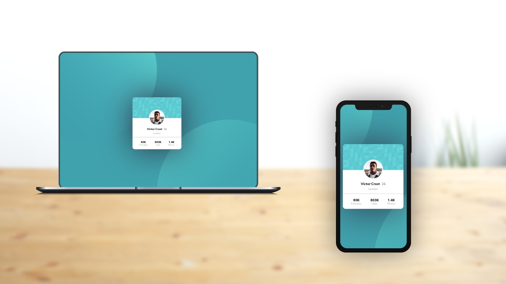

# Profile card component

This is a solution to the [Profile card component challenge on Frontend Mentor](https://www.frontendmentor.io/challenges/profile-card-component-cfArpWshJ). Frontend Mentor challenges help you improve your coding skills by building realistic projects. 

## Table of contents

- [Profile card component solution](#profile-card-component-solution)
  - [Table of contents](#table-of-contents)
  - [Overview](#overview)
    - [The challenge](#the-challenge)
    - [Screenshot](#screenshot)
  - [Front-end Style Guide](#front-end-style-guide)
    - [Layout](#layout)
    - [Colors](#colors)
    - [Typography](#typography)
    - [Font](#font)
    - [Links](#links)
  - [My process](#my-process)
    - [Built with](#built-with)
  - [Author](#author)

## Overview

### The challenge

- Build out the project to the designs provided

### Screenshot

## Front-end Style Guide

### Layout

The designs were created to the following widths:

- Mobile: 375px
- Desktop: 1440px

### Colors

_Primary_

Dark cyan: hsl(185, 75%, 39%)
Very dark desaturated blue: hsl(229, 23%, 23%)
Dark grayish blue: hsl(227, 10%, 46%)

_Neutral_

Dark gray: hsl(0, 0%, 59%)

### Typography

- Font size (name and stats): 18px

### Font

- Family: [Kumbh Sans](https://fonts.google.com/specimen/Kumbh+Sans)
- Weights: 400, 700

### Links

- Live Site URL: [https://benjaminvillatte.github.io/fem-profile-card-component/](https://benjaminvillatte.github.io/fem-profile-card-component/)

## My process

### Built with

- Semantic HTML5 markup
- CSS custom properties
- Flexbox
- Mobile-first workflow

## Author

- Website - [Benjamin VILLATTE](https://www.benjaminvillatte.fr)
